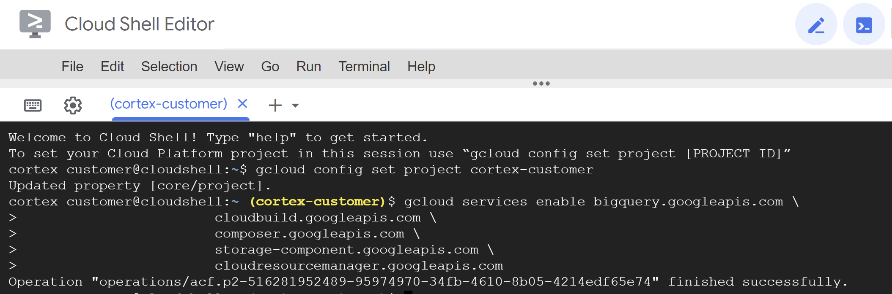
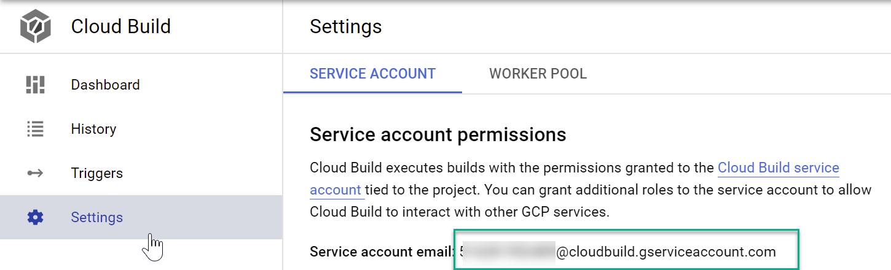
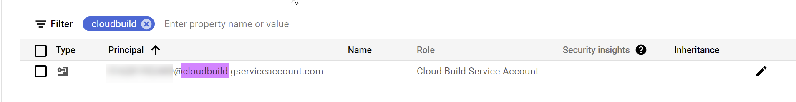
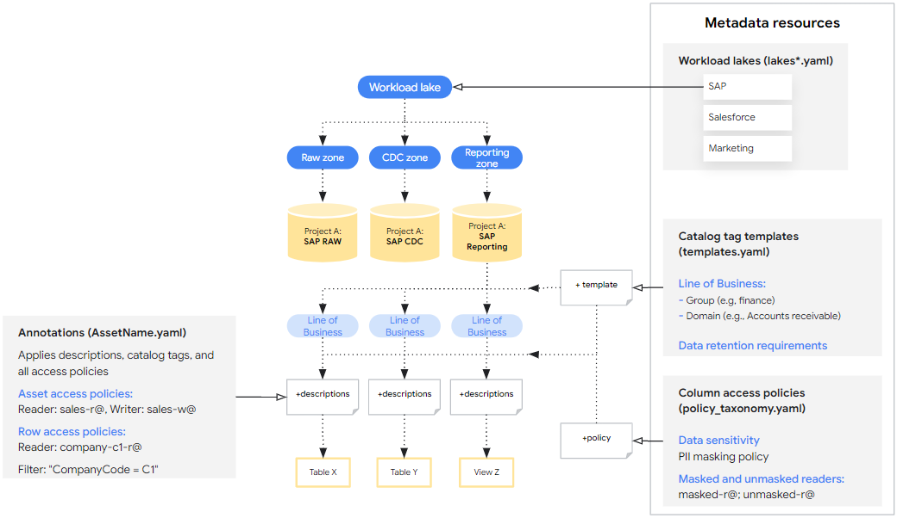
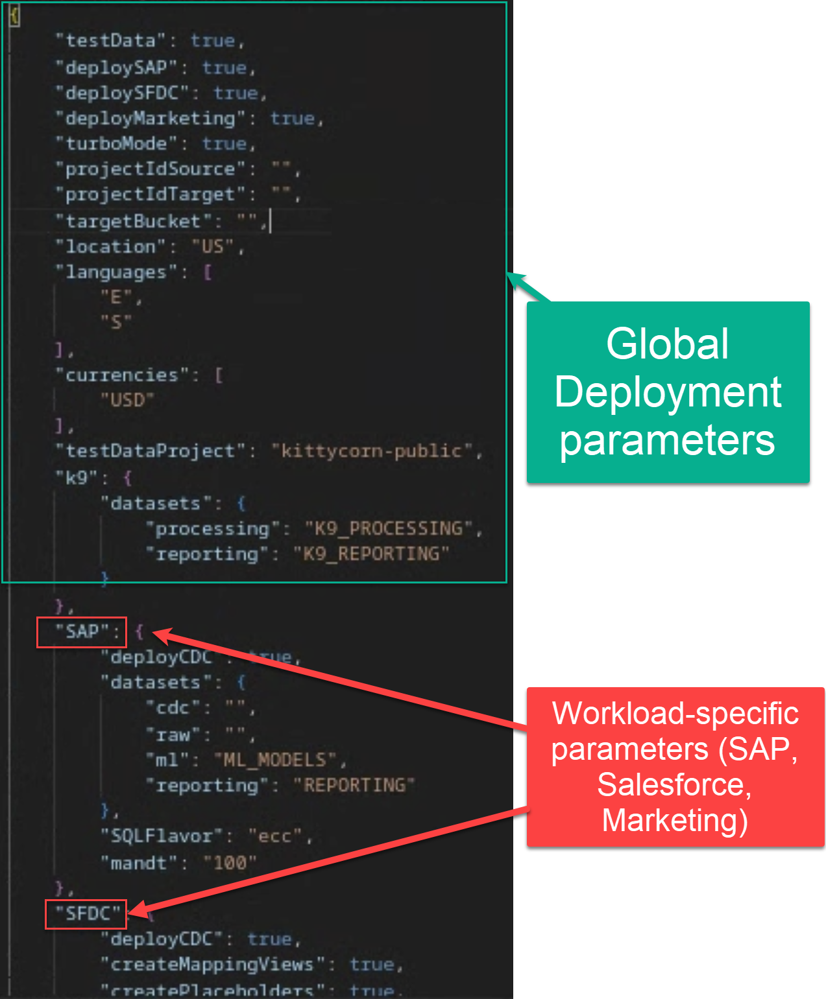
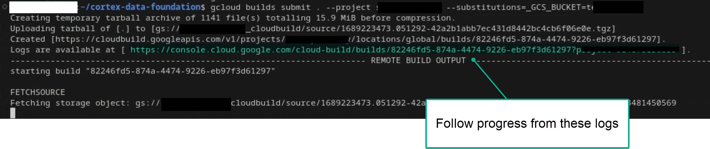
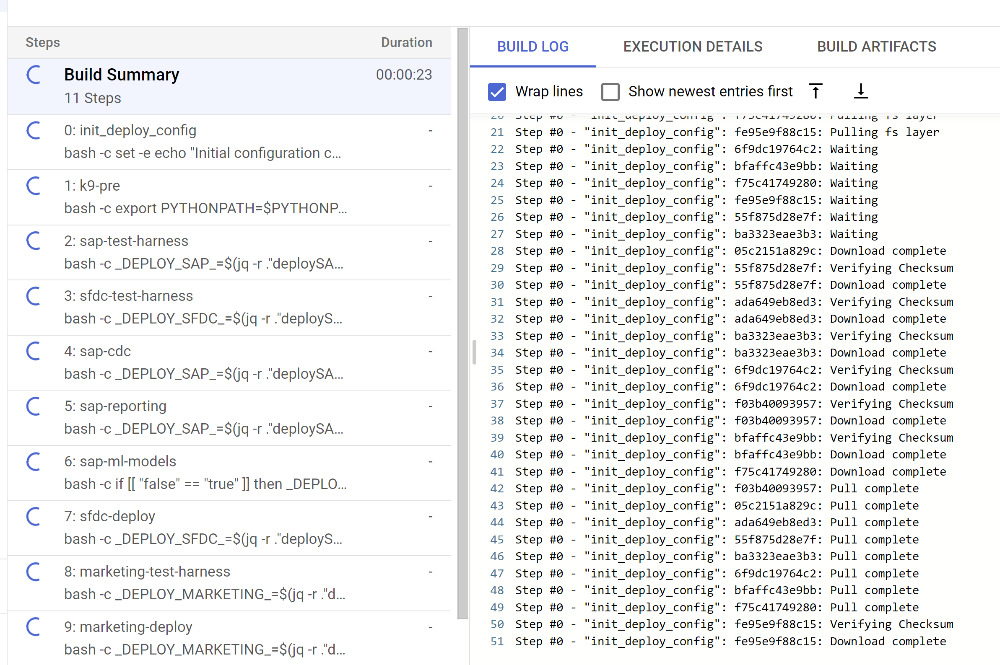
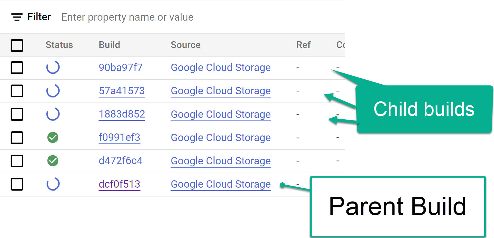
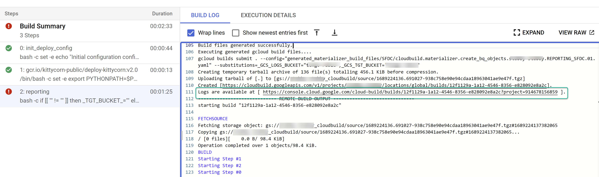
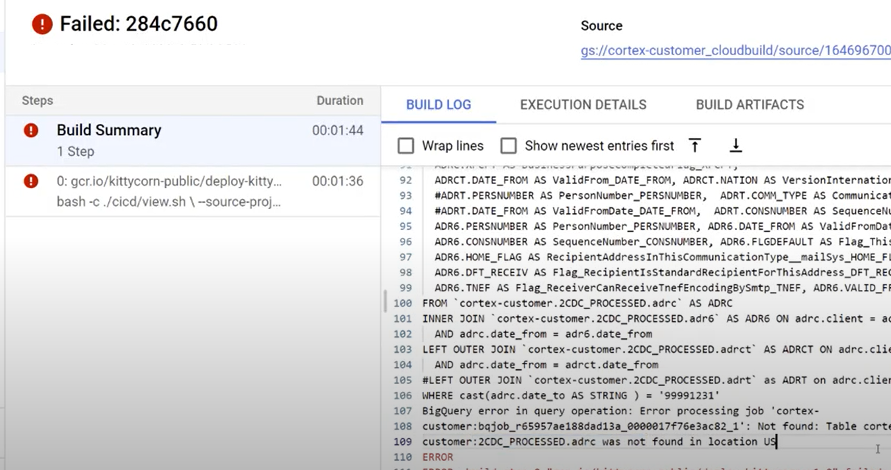

#

## Main Cortex
git clone --recurse-submodules https://github.com/asynchronos/cortex-data-foundation.git

## Sub Modules

```console
cd src

git clone https://github.com/GoogleCloudPlatform/cortex-dag-generator.git src\SAP_CDC
git clone https://github.com/GoogleCloudPlatform/cortex-ml-models.git src\SAP_ML_MODELS
git clone https://github.com/GoogleCloudPlatform/cortex-reporting.git src\SAP_REPORTING

git clone https://github.com/GoogleCloudPlatform/cortex-salesforce.git SFDC
git clone https://github.com/GoogleCloudPlatform/cortex-marketing.git marketing
```

## Configure Google Cloud Platform components

### Enable Required Components

The following Google Cloud components are required:
*   Google Cloud Project
*   BigQuery instance and datasets
*   Service Account with Impersonation rights
*   Cloud Storage Buckets
*   Cloud Build API
*   Cloud Resource Manager API
*   Optional components:
    *   [Cloud Composer](https://console.cloud.google.com/marketplace/product/google/composer.googleapis.com) for change data capture (CDC) processing (SAP and Salesforce), hierarchy flattening (SAP only), and data replication (Salesforce only) through Directed Acyclic Graphs ([DAG](https://airflow.apache.org/docs/apache-airflow/stable/concepts/dags.html)s). You can find how to set up an instance of Cloud Composer in the [documentation](https://cloud.google.com/composer/docs/how-to/managing/creating).
    *   Looker **(optional, connects to reporting templates. Requires manual setup) **
    *   [Analytics Hub](https://cloud.google.com/analytics-hub) linked datasets (**optional**) are currently used for some external sources, such as the Weather DAG. You may choose to fill this structure with any other available source of your choice for advanced scenarios.
    *   [Dataflow](https://console.cloud.google.com/dataflow): Integration tool for Google Ads.
    *   [Dataplex](https://cloud.google.com/dataplex): Used for Data Mesh

From the [Cloud Shell](https://shell.cloud.google.com/?fromcloudshell=true&show=ide%2Cterminal), you can enable Google Cloud Services using the _gcloud_ command line interface in your Google Cloud project.

Replace the `<SOURCE_PROJECT>` placeholder with your source project. Copy and paste the following command into the cloud shell:


```bash
gcloud config set project bcp-datahub

gcloud services enable bigquery.googleapis.com \
                       cloudbuild.googleapis.com \
                       storage-component.googleapis.com \
                       cloudresourcemanager.googleapis.com \
                       dataplex.googleapis.com

```

Optional:
```bash
gcloud services enable composer.googleapis.com \
                       dataflow.googleapis.com
```

You should get a success message:



### Configure the Cloud Build account

In the source project, navigate to the [Cloud Build](https://console.cloud.google.com/cloud-build/settings/service-account) and locate the account that will execute the deployment process.



Locate the build account in [IAM](https://pantheon.corp.google.com/iam-admin/iam) (make sure it says _cloudbuild_):



Grant the following permissions to the Cloud Build service account in both the source and target projects if they are different:

- BigQuery Data Editor
- BigQuery Job User

[Optional] If changing the default values for Data Mesh in `config/config.json` to implement features beyond descriptions, the executing account (Cloud Build service account) will need to have the following permissions:
- Policy Tag Admin
- Data Catalog TagTemplate Owner
- Dataplex Editor
- BigQuery Data Owner

### Create a Storage bucket for storing DAG related files

A storage bucket will be required to store processing DAG scripts and other temporary files generated during deployment. These scripts will have to be manually moved into a Cloud Composer or Apache Airflow instance after deployment.

Navigate to [Cloud Storage](https://console.cloud.google.com/storage/create-bucket) and create a bucket **in the same region** as your BigQuery datasets.

**Alternatively**, you can use the following command to create a bucket from the Cloud Shell:

```bash
gsutil mb -l asia-southeast1 gs://poc-sap-cortex-scripts
```

Navigate to the _Permissions_ tab. Grant `Storage Object Creator` to the user executing the Build command or to the Service account you created for impersonation.

### Create a Storage bucket for logs

You can create a specific bucket for the Cloud Build process to store the logs. This is useful if you want to restrict data that may be stored in logs to a specific region. Create a [GCS bucket](https://console.cloud.google.com/storage) with uniform access control, in the same region where the deployment will run.

**Alternatively**, here is the command line to create this bucket:

```bash
gsutil mb -l asia-southeast1 gs://poc-sap-cortex-logs
```

You will need to grant `Object Admin` permissions to the Cloud Build service account.

## Configure Data Mesh
The default configuration in `config/config.json` for Data Mesh will add the descriptions for all assets, but will not create any other structures or policies.

Enabling any other options (e.g., deployLakes, deployCatalog, deployACLs) requires the configuration of permissions for the Cloud Build service account and the necessary configuration of the yaml files.

Here is a high-level diagram of the available options:



You will find detailed instructions and examples to configure Data Mesh in the [documentation](https://github.com/GoogleCloudPlatform/cortex-data-foundation/tree/main/docs/data_mesh/README.md).

## Configure Deployment

The behavior of the deployment is controlled by the configuration file [config.json](https://github.com/GoogleCloudPlatform/cortex-data-foundation/blob/main/config/config.json).

The file contains global configuration and configuration specific to each workload.



Open the file in `config/config.json`. From the Cloud Shell:

```bash
edit config/config.json
```

<details>
  <summary>[Optional] Configure K9  external datasets </summary>

## Configure SAP Hierarchies

You can use the configuration in the file [`sets.yaml`](https://github.com/GoogleCloudPlatform/cortex-reporting/blob/main/local_k9/hier_reader/sets.yaml) if you need to generate scripts to flatten hierarchies. See the [Appendix - Configuring the flattener](#configuring-the-flattener-for-sap-hierarchies) for options. This step is only executed if the CDC generation flag is set to `true`.

## Configure External Datasets for K9

Some advanced use cases may require external datasets to complement an enterprise system of record such as SAP. In addition to external exchanges consumed from [Analytics hub](https://cloud.google.com/analytics-hub), some datasets may need custom or tailored methods to ingest data and join them with the reporting models.

**Note:** You will need to configure the DAGs as follows:

1. **Holiday Calendar**: This DAG retrieves the holiday calendars from  [PyPi Holidays](https://pypi.org/project/holidays/). You can adjust the list of countries and years to retrieve holidays, as well as parameters of the DAG from the file `holiday_calendar.ini`. Leave the defaults if using test data.
2. **Product Hierarchy Texts**: This DAG flattens materials and their product hierarchies. The resulting table can be used to feed the `Trends` list of terms to retrieve Interest Over Time. You can adjust the parameters of the DAG from the file `prod_hierarchy_texts.py`. Leave the defaults if using test data. You will need to adjust the levels of the hierarchy and the language under the markers for `## CORTEX-CUSTOMER:`. If your product hierarchy contains more levels, you may need to add an additional SELECT statement similar to the CTE `h1_h2_h3`.
3. **Trends**: This DAG retrieves Interest Over Time for a specific set of terms from [Google Search trends](https://trends.google.com/trends/). The terms can be configured in `trends.ini`. You will need to adjust the time frame to `'today 7-d'` in `trends.py` after an initial run. We recommend getting familiarized with the results coming from the different terms to tune parameters. We also recommend partitioning large lists to multiple copies of this DAG running at different times. For more information about the underlying library being used, see [Pytrends](https://pypi.org/project/pytrends/).
2. **Weather**: By default, this DAG uses the publicly available test dataset [**bigquery-public-data.geo_openstreetmap.planet_layers**](https://console.cloud.google.com/bigquery/analytics-hub/exchanges(analyticshub:search)?queryText=open%20street%20map). The query also relies on an NOAA dataset only available through Analytics Hub, [**noaa_global_forecast_system**](https://console.cloud.google.com/bigquery/analytics-hub/exchanges(analyticshub:search)?queryText=noaa%20global%20forecast).  **`This dataset needs to be created in the same region as the other datasets prior to executing deployment`**. If the datasets are not available in your region, you can continue with the following instructions and follow additional steps to transfer the data into the desired region.

**You can skip this configuration if using test data.**

* Navigate to [BigQuery > Analytics Hub](https://console.cloud.google.com/bigquery/analytics-hub)
* Click **Search Listings**. Search for "`NOAA Global Forecast System`"
* Click **Add dataset to project**. When prompted, keep "`noaa_global_forecast_system`" as the name of the dataset. If needed, adjust the name of the dataset and table in the FROM clauses in `weather_daily.sql`.
* Repeat the listing search for Dataset "`OpenStreetMap Public Dataset`".
* Adjust the `FROM ` clauses containing `bigquery-public-data.geo_openstreetmap.planet_layers` in `postcode.sql`.

[**Analytics hub is currently only supported in EU and US locations**](https://cloud.google.com/bigquery/docs/analytics-hub-introduction) and some datasets, such as NOAA Global Forecast, are only offered in a single multilocation.
If you are targeting a location different from the one available for the required dataset, we recommend creating a [scheduled query](https://cloud.google.com/bigquery/docs/scheduling-queries) to copy the new records from the Analytics hub linked dataset followed by a [transfer service](https://cloud.google.com/bigquery-transfer/docs/introduction) to copy those new records into a dataset located in the same location or region as the rest of your deployment. You will then need to adjust the SQL files .

**Important Note:** Before copying these DAGs to Cloud Composer, you will need to **add the required python modules (`holidays`, `pytrends`) [as dependencies](https://cloud.google.com/composer/docs/how-to/using/installing-python-dependencies#options_for_managing_python_packages)**.

[Return to top of section](#workload-specific-configuration)

</details>

## Check for `CORTEX_CUSTOMER` tags
Many SAP and Salesforce customers will have specific customizations of their systems, such as additional documents in a flow or specific types of a record. These are specific to each customer and configured by functional analysts as the business needs arise. The spots on the SQL code where these specific enhancements could be done are marked with a comment starting with `## CORTEX-CUSTOMER`. You can check for these comments after cloning the repository with a command like:

```bash
grep -R CORTEX-CUSTOMER
```

> **Note**: There may be additional customizations depending on the source systems. We recommend getting the business users or analysts involved early in the process to help spot these.

## Performance optimization for Reporting views

Reporting artifacts can be created as views or as tables refreshed regularly through DAGs. On the one hand, views will compute the data on each execution of a query, which will keep the results always fresh. On the other hand, the table will run the computations once, and the results can be queried multiple times without incurring higher computing costs and achieving faster runtime. This balance is very specific to each customer, so we encourage each customer to create their own configuration to serve their needs.

Materialized results are updated into a table. These tables can be further fine-tuned by adding Partitioning and Clustering properties to these tables.

The configuration files for each workload are:
| Data Source             | Settings files                                               |
| ------------------------| ------------------------------------------------------------ |
| SAP                     | `src/SAP/SAP_REPORTING/reporting_settings_ecc.yaml`          |
| Salesforce              | `src/SFDC/config/reporting_settings.yaml`                    |
| Marketing - Google Ads  | `src/marketing/src/GoogleAds/config/reporting_settings.yaml` |
| Marketing - CM360       | `src/marketing/src/CM360/config/reporting_settings.yaml`     |


###  Customizing `reporting_settings` file configuration

This settings file drives how the BQ objects (tables or views) for Reporting datasets are created.

There are two sections:

 1. `bq_independent_objects`:
    All BigQuery objects that can be created independently, without any other dependencies.
    > **Note**: When Turbo mode is enabled, these BQ objects are created in parallel during the deployment time, speeding up the deployment process.

 2. `bq_dependent_objects`:
     All BigQuery objects that need to be created in a specific order due to dependencies on other BQ objects.
     > **Note**: Turbo mode does not apply to this section - i.e., each object will be created one after another.

The deployer will first create all the BQ Objects listed in `bq_independent_objects` first, and then all the objects
listed in `bq_dependent_objects`.

Following properties need to be defined for each object:
1. `sql_file`:  Name of the sql file that will create a given object.

2. `type`: Type of BQ Object.
    Possible values:
    * `view` : If we want the object to be a BQ view.
    * `table`: If we want the object to be a BQ table.
    * `script`: This is to create other types of objects (BQ Functions, Stored Procs etc)

3. If `type` is `'table'`, then following optional properties can be defined:
     * `load_frequency`: Frequency at which a Composer DAG will be executed to refresh this table. Mandatory. See [Airflow documentation](https://airflow.apache.org/docs/apache-airflow/1.10.1/scheduler.html#dag-runs) for details on possible values.
     * `partition_details`: How the table should be partitioned. **Optional.** See Appendix section [Table Partition and Cluster Settings](#table-partition-and-cluster-settings) for details on how to configure this.
     * `cluster_details`: How the table should be clustered. **Optional.** See Appendix section [Table Partition and Cluster Settings](#table-partition-and-cluster-settings) for details on how to configure this.

## Execute Deployment

This step requires `config.json` to be configured as described in the section [Configure Deployment](#configure-deployment).

Run the Build command with the target log bucket.

```bash
gcloud builds submit --project bcp-datahub \
    --substitutions=_GCS_BUCKET=poc-sap-cortex-logs
```
You can follow the main Build process from the first link of logs:



Alternatively, if you have enough permissions, you can see the progress from [Cloud Build](https://console.cloud.google.com/cloud-build/).



Each build step will trigger child build steps. These can be tracked from the Cloud Build console:



Or finding the logs for the child build within the log from a step:



And identify any issues with individual builds:



We recommend pasting the generated SQL into BigQuery to identify and correct the errors more easily. Most errors will be related to fields that are selected but not present in the replicated source. The BigQuery UI will help identify and comment those out.

## Move the files into the DAG bucket

If you opted to generate integration or CDC files and have an instance of Airflow, you can move them into their final bucket with the following command:

```bash
gsutil -m cp -r  gs://<output bucket>/dags/ gs://<composer dag bucket>/
gsutil -m cp -r  gs://<output bucket>/data/ gs://<composer sql bucket>/
```

## Test, customize and prepare for upgrade

In addition to the `CORTEX-CUSTOMER` tags, you may need to further customize the content to add business rules, add other datasets and join them with existing views or tables, reuse the provided templates to call additional APIs, modify deployment scripts, apply further data mesh concepts, etc.  You may also need to slightly adapt some tables or landed APIs to include additional fields not included in our standard. We recommend committing all of these changes with a clear tag in the code to your own fork or clone of our git repositories.

We recommend adopting a CICD pipeline that works for your organization, to keep these enhancements tested and your overall solution in a reliable, robust state. A simple pipeline can reuse our `cloudbuild*.yaml` scripts to trigger end to end deployment periodically, or based on git operations depending on your repository of choice by [automating builds](https://cloud.google.com/build/docs/automating-builds/create-manage-triggers). Using automated testing with your own sample data will help ensure the models always produce what you expect every time someone commits a change. The `config.json` file plays an important role in defining different sets of projects and datasets for development, staging and production environments.

Tagging your own changes visibly in your fork or clone of a repository together with some deployment and testing automation will be very helpful when performing upgrades. Check out this [guide for upgrade instructions](https://github.com/GoogleCloudPlatform/cortex-data-foundation/blob/main/docs/upgrade_recommendations/upgrade_recommendations.md).
